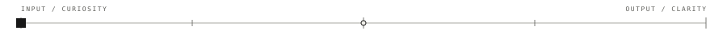
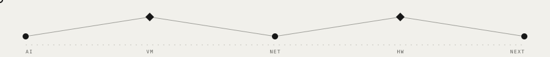
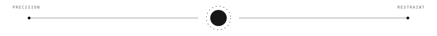

  

## `00 / POSITION`

### Software should explain itself.

I work across software engineering and data, with a bias toward small systems, direct experiments, and code another person can run without a guided tour.

  
  
  
  

  

---

## `01 / SELECTED RECORDS`

<table>
<tr>
<td width="50%" valign="top">

01 / AI SYSTEMS

### [`ragops`](https://github.com/iliasreg/ragops) ↗

A RAG-based diagnostic tool that analyzes AWS CloudWatch logs.

</td>
<td width="50%" valign="top">

02 / LOW LEVEL

### [`vmi`](https://github.com/iliasreg/vmi) ↗

A compact stack-based virtual machine with its own instruction set.

</td>
</tr>
<tr>
<td width="50%" valign="top">

03 / NETWORKING

### [`lbi`](https://github.com/iliasreg/lbi) ↗

Weighted round-robin load balancing, implemented in Go and kept intentionally small.

</td>
<td width="50%" valign="top">

04 / HARDWARE

### [`piNAS`](https://github.com/iliasreg/piNAS) ↗

An ultra-low-power Raspberry Pi NAS with secure remote access.

</td>
</tr>
</table>

  

<strong>More selected work</strong>

 

- [`can-bus-project`](https://github.com/iliasreg/can-bus-project) — sensor acquisition from a CAN bus using STM32 and Python.
- [`ilias-portfolio`](https://github.com/iliasreg/ilias-portfolio) — the Angular portfolio and visual identity behind this profile.

---

## `02 / WORKING PRINCIPLE`

<table>
<tr>
<td width="18%" align="center" valign="middle">

# ○

</td>
<td valign="middle">

> ### *Make it clear. Test the important part. Keep moving.*
>
> WORKING SOFTWARE OVER COMPLICATED PROMISES.

</td>
</tr>
</table>

  

---

## `03 / LINKS`

